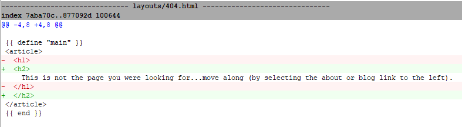

My next steps was to override the theme's 404 page. I did this by copying the `themes/layouts/404.html` file to `themes` folder off the root of the site. Here is the contents of the file:

```html
{{ define "styles" }}
    {{ $.Scratch.Set "style_opts" (dict "src" "scss/pages/404.scss" "dest" "css/404.css") }}
{{ end }}

{{ define "main" }}
<article>
  <h1>
    This is not the page you were looking for
  </h1>
</article>
{{ end }}
```

Next, I updated the `404.html` file content to carry on the allusion to the A New Hope Star Wars movie by updating the text displayed to the user:

```html
  <h1>
    This is not the page you were looking for...move along (by selecting the about or blog link to the left).
  </h1>
```

After viewing the page in the browser, I noticed that the text displayed to the user was too large. I updated the text via changing the header tag size to `h2`.



I then committed the changes to the `404.html` file and pushed the changes to the `main` branch. After the GitHub Action completed the build, I was able to see the changes reflected in the browser.

Then, after that I made another change to the `404.html` file. I added an H1 tag to the top of the page and changed the H2 tag to an H3 tag.  

```html
<article>
  <h1>Oops! 404</h1>
  <h3>
    This is not the page you were looking for...move along (by selecting the about or blog 
    link to the left or the menu above).
  </h3>
</article>
```

Again, I pushed the changes to the remote `main` branch and GitHub Action completed the build.
