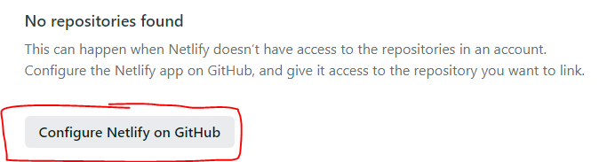
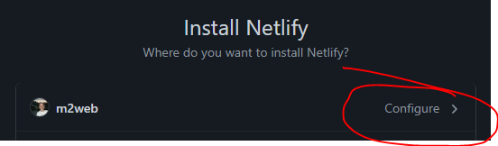
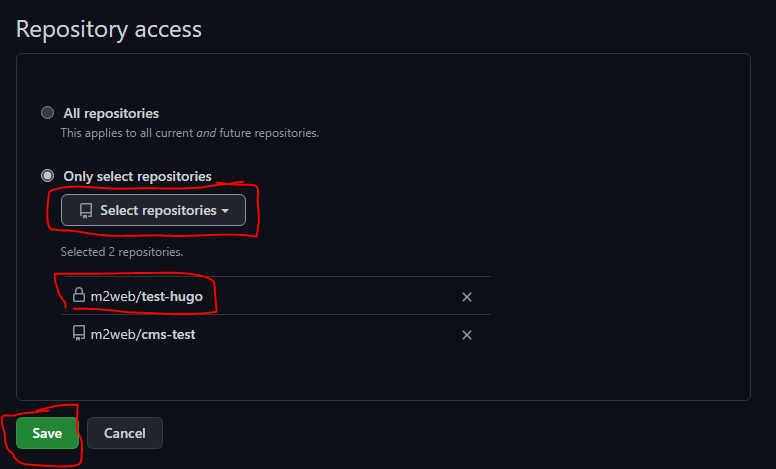
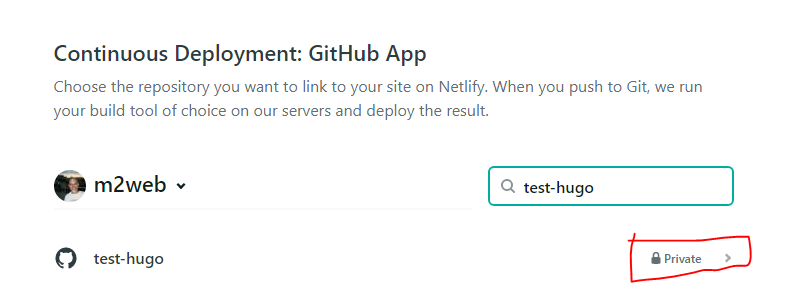
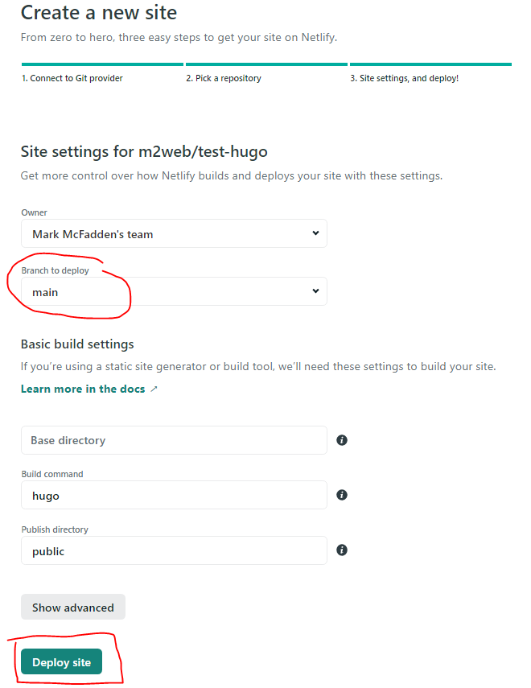
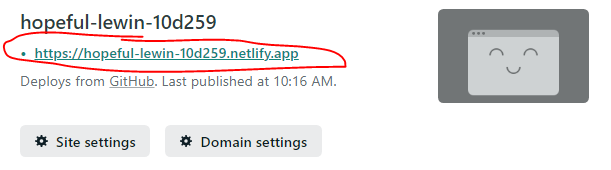
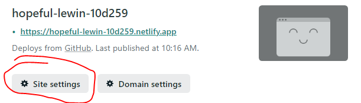
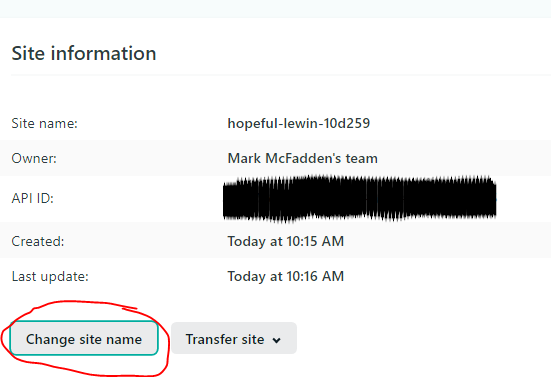

You have a Hugo site created and also have a GitHub repository for the
site. Now, you can deploy the site for free via Netlify.

First, if you do not already have a Netlify account, create one. Then,
login to Netlify.

If you search for your repo and do not find it, select the `Configure
Netlify` on GitHub button.

Then select where, which GitHub account, you want to install Netlify:

In the `Repository access` section select the `Only select repositories`
radio button and then the `Select repositories` drop down button. After
selecting the desired repository, select the `Save` button.

Now you have your repo, select either its `Private` or `Public` visibility
from GitHub. In my case, this repository is `Private`:

Finally, make sure that you have the desired `Branch to deploy` selected
and then deploy the site to Netlify by selecting the `Deploy site` button.

Once Netlify has completed the deployment of your site, select the link
and view it.

You can rename the subdomain of your site by selecting the `Site settings`
button

Then, in the Site information section, select the `Change site name`
button.

Now, you have a published site on Netlify that will update with each
push to you main branch in your GitHub repository.
