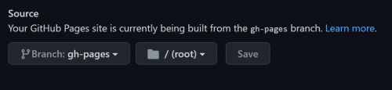

# NKU BIS 402 Course Repository

* First, the hugo new site quickstart guide: <https://gohugo.io/getting-started/quickstart/>
* Next, added the theme from <https://github.com/jakewies/hugo-theme-codex>
* Then, from the root of your Hugo site, type the following:

```bash
git submodule add https://github.com/jakewies/hugo-theme-codex.git themes/hugo-theme-codex
git submodule init
git submodule update
```

* To get started, copy the `config.toml` file inside `exampleSite` to the root of your Hugo site:

```bash
cp themes/hugo-theme-codex/exampleSite/config.toml .
```

* Note that if you are cloning this repo, then you only do the following from the CLI:

```bash
git submodule init
git submodule update
```

* Next, make updates to the `config.toml` file in the root of your Hugo site using the theme's exampleSite/config.toml file:

```toml
# DO NOT REMOVE THIS
theme = "hugo-theme-codex"

# Override these settings with your own
title = "BIS 402"
languageCode = "en-us"
baseURL = "https://bis402.github.io/"
copyright = "© {year}"

# Optional params
[params]
  # Follow the Hugo date/time format reference here: 
  # https://gohugo.io/functions/format/#gos-layout-string
  dateFormat = "Jan 2 2006"

  # Links to your social accounts, comment/uncomment as needed. Icons will be displayed for those specified.
  twitter = "https://twitter.com/m2web"
  github = "https://github.com/BIS402"
  email = "mailto:mcfaddenm1@nku.edu"
    
  # Titles for your icons (shown as tooltips), and also their display order.
  # Currently, these icons are supported: 
  #   "Twitter", "GitHub", "Email", "Mastodon", "Facebook", "GitLab", "Instagram", "LinkedIn", "YouTube"
  iconOrder = ["Twitter", "GitHub"]

  # Metadata for Twitter cards, defaults to params.twitter
  twitterSite = "@m2web"
  twitterAuthor = "@m2web"

  # Set to true to display page title in table of contents in blog posts.
  showPageTitleInTOC = false

# This disables Hugo's default syntax highlighting in favor
# of prismjs. If you wish to use Hugo's default syntax highlighting
# over prismjs, remove this. You will also need to remove the prismjs
# vendor script in layouts/blog/single.html.
[markup]
  [markup.highlight]
    codeFences = false
    
  # Set to false to disallow raw HTML in markdown files
  [markup.goldmark.renderer]
      unsafe = true

# Controls the navigation
[[menu.main]]
  identifier = "about"
  name = "about"
  title = "About"
  url = "/"

[[menu.main]]
  identifier = "blog"
  name = "blog"
  title = "Blog"
  url = "/blog"

[params.colors]
    fancy = "#FFD700"
```

* After this, I added a `favicon.ico` file to the `static/images` directory. To display the favicon in the web browser tab I added a `layouts/partials/header.html` file by copying the the `themes/layouts/partials/header.html` file to the root of my Hugo site. I did this to override the default header. Within the `layouts/partials/favicon.html` file I added the following:

```html
<link rel="shortcut icon" href="images/favicon.ico" type="image/x-icon">
```

* I then added a meta name keyword tag (words relevant to the page's content separated by commas) to the `layouts/partials/favicon.html` file. I did this by adding the following:

```html
<meta name="keywords" content="NKU, Northern Kentucky University, BIS 402, Programming for E-Business"/>
```

* Next, I added a .github/workflows folder to the root of my Hugo site and then a gh-pages.yml file to the workflows folder. Following the example gh-pages.yml in <https://github.com/peaceiris/actions-hugo> I updated the gh-pages.yml file to the following:

```yaml
name: GitHub Pages
on:
  push:
    branches:
      - main  # Set a branch name to trigger deployment
  pull_request:
jobs:
  deploy:
    runs-on: ubuntu-20.04
    concurrency:
      group: ${{ github.workflow }}-${{ github.ref }}
    steps:
      - uses: actions/checkout@v2
        with:
          submodules: true  # Fetch Hugo themes (true OR recursive)
          fetch-depth: 0    # Fetch all history for .GitInfo and .Lastmod
      - name: Setup Hugo
        uses: peaceiris/actions-hugo@v2
        with:
          hugo-version: 'latest'
          extended: true
      - name: Build
        run: hugo --minify
      - name: Deploy
        uses: peaceiris/actions-gh-pages@v3
        if: ${{ github.ref == 'refs/heads/main' }}
        with:
          github_token: ${{ secrets.GITHUB_TOKEN }}
          publish_dir: ./public

```

* Then, after several trial and errors with getting the settings correct, I pushed the final gh-pages.yml changes to GitHub. I did this by typing the following:

```bash
git add .
git commit -m "Update gh-pages.yml with extended hugo version using Hugo site recommended settings"
git push
```

* After this, I noted that the GitHub Pages site was only displaying a site link and the readme.md file content. Again, after many trials and tribulations I then updated the GitHub Pages settings Source branch to gh-pages and pointing to the root folder:
<!-- markdown image -->


* Finally, the site displayed correctly!
