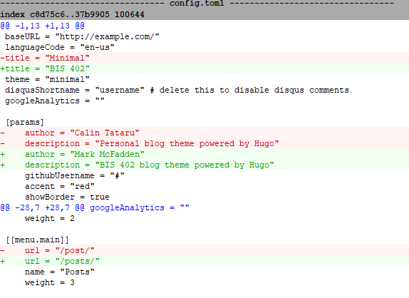

# NKU BIS 402 Course Repository

* First, the hugo new site quickstart guide: https://gohugo.io/getting-started/quickstart/
* Next, added the theme from https://github.com/calintat/minimal 
* Then, from the root of your Hugo site, type the following:

```
$ git submodule add https://github.com/calintat/minimal.git themes/minimal
$ git submodule init
$ git submodule update
```

* Now you can get updates to Minimal in the future by updating the submodule:

```
$ git submodule update --remote themes/minimal
```

* To get started, copy the `config.toml` file inside `exampleSite` to the root of your Hugo site:

```
$ cp themes/minimal/exampleSite/config.toml .
```

* Note that if you are cloning this repo, then you only do the following from the CLI:

```
$ git submodule init
$ git submodule update
```

* Next, make updates to the `config.toml` file in the root of your Hugo site. For example:



* After this, I added a `favicon.ico` file to the `static/images` directory. To display the favicon in the web browser tab I added a `layouts/partials/header.html` file by copying the the `themes/layouts/partials/header.html` file to the root of my Hugo site. I did this to override the default header. Within the `layouts/partials/header.html` file I added the following:

```
<link rel="shortcut icon" href="images/favicon.ico" type="image/x-icon">
```

* I then added a meta name keyword tag (words relevant to the page's content separated by commas) to the `layouts/partials/header.html` file. I did this by adding the following:

```
<meta name="keywords" content="NKU, Northern Kentucky University, BIS 402, Programming for E-Business"/>
```
